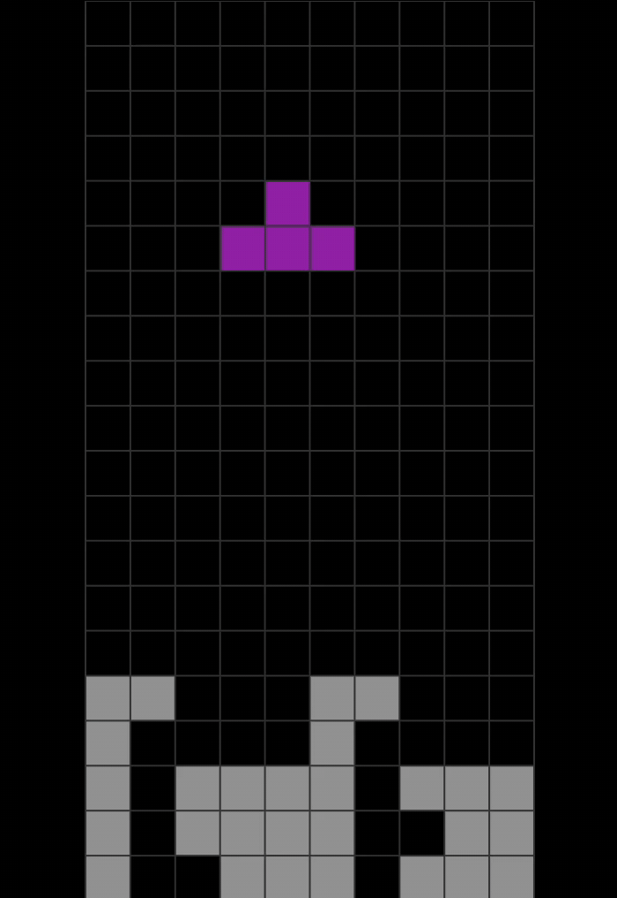

# Tetris for Flutter

[Tetris](https://harddrop.com/wiki/Gameplay_overview) implementation
with [SRS](https://harddrop.com/wiki/SRS)
and [wall kicks](https://harddrop.com/wiki/SRS#Wall_Kicks)
. [Try it](https://andnexus.github.io/flutter_tetris/). 

## Controls

Control Tetrominos with keyboard or gestures.

| Action                  | Key   | Gesture                 |
|-------------------------|-------|-------------------------|
| move right              |   →   | swipe right             |
| move left               |   ←   | swipe left              |
| rotate right            |   D   | tap right               |
| rotate left             |   A   | tap left                |
| hold                    |   ↑   | swipe up                |
| soft drop               |   ↓   | hold and swipe down     |
| hard drop               | SPACE | swipe down              |
| Restart                 |  ESC  |                         |
